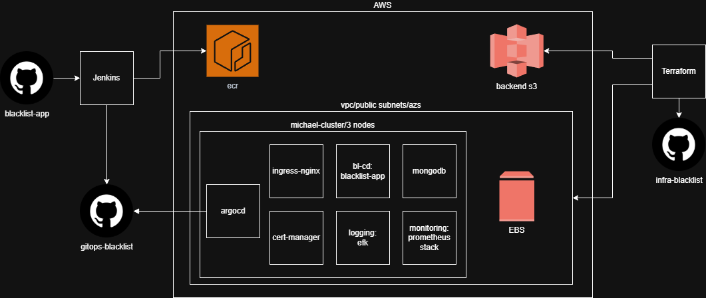

# Blacklist App CI/CD Pipeline

## 📌 Project Description
This repository contains the CI/CD pipeline for the **Blacklist** application. The pipeline automates the process of building, testing, and deployment.

## 🚀 CI/CD Architecture

### 📂 Main Components:
- **CI (Continuous Integration):**
  - Code validation
  - Running tests
  - Building artifacts
- **CD (Continuous Deployment):**
  - Deployment to staging/prod
  - Monitoring and notifications

### 🔧 Technologies Used:
- **Terraform** – Infrastructure as Code
- **AWS (S3, ECS, IAM)** – Cloud resources
- **Jenkins** – Pipeline automation
- **Docker** – Containerization
- **Kubernetes (EKS)** – Container orchestration
