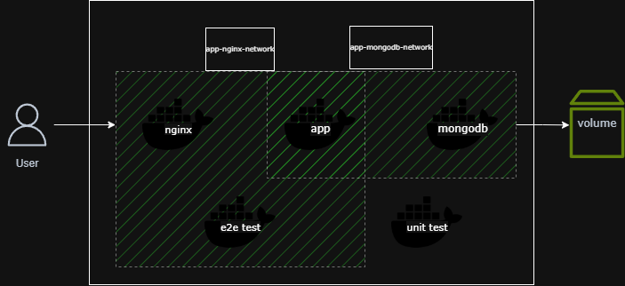

# Black List App

Black List App is an application for managing a blacklist. It consists of three main components:
- **MongoDB** — for data storage.
- **Nginx** — for request proxying.
- **Flask Application** — the core logic for managing the blacklist.

The project includes Docker Compose for local deployment and a set of tests (unit and e2e) that can be run using Docker.



---

## Table of Contents

- [Installation and Setup](#installation-and-setup)
- [Running Tests](#running-tests)
  - [Unit Tests](#unit-tests)
  - [End-to-End (e2e) Tests](#end-to-end-e2e-tests)
- [Technologies](#technologies)

---

## Installation and Setup

To run the application locally, follow these steps:

1. Ensure you have Docker and Docker Compose installed.
2. Clone the repository:
   ```bash
   git clone https://github.com/your-username/black-list-app.git
   cd black-list-app
3. ```
   docker compose up --build
   ```
5. Access the application:
   Once the application is running, it will be accessible at:
   ```
   http://localhost:80
   ```

---

## Running Tests

Unit Tests
To run the unit tests, use the following commands:
```
docker build -f tests/Dockerfile-unit -t black-list-app-unit-tests .
docker run black-list-app-unit-tests
```
End-to-End (e2e) Tests
To run the end-to-end tests, use the following command:
```
docker compose -f tests/docker-compose.yml up --build
```
---

## Technologies
- Docker — for containerizing the application.
- Docker Compose — for orchestrating containers.
- Nginx — for request proxying and providing static files.
- MongoDB — for data storage.
- Flask — Python web framework for the core application.
