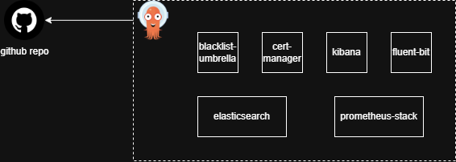

# GitOps-Blacklist

This repository contains a GitOps configuration for deploying and managing the **Blacklist Application** and its associated infrastructure using ArgoCD. The setup leverages the **App of Apps** pattern to manage multiple components.



## Components Deployed

1. **Blacklist Application**  
   - Deployed as a Helm chart.
   - Includes:
     - **Ingress-NGINX** for handling HTTP/S traffic.
     - **MongoDB** as the database.

2. **Cert-Manager**  
   - Automates certificate provisioning and management.

3. **EFK Stack** for logging:  
   - **Elasticsearch** for log storage and searching.  
   - **Fluent Bit** for log collection.  
   - **Kibana** for visualization.

4. **Prometheus** for monitoring and alerting.  

## Key Features

- **App of Apps** Pattern:  
  ArgoCD uses a parent application to manage child applications, ensuring a modular and scalable setup.  

- **GitOps Workflow**:  
  Infrastructure and application configurations are version-controlled and deployed automatically based on Git changes.

- **TLS/SSL Certificates**:  
  Certificates are managed using Cert-Manager, enabling secure communication for all services.

---


## Prerequisites

- **ArgoCD** installed and configured in your Kubernetes cluster.
- A working Kubernetes cluster.
- Domain and DNS configured for Ingress.
- Terraform setup for infrastructure provisioning (if required).

## Setup and Deployment

1. **Clone the repository**:
   ```bash
   git clone https://github.com/your-username/gitops-blacklist.git
   cd gitops-blacklist
2. Bootstrap ArgoCD: Apply the parent App of Apps manifest:
   ```bash
   kubectl apply -f apps/
   ```
3. Verify Deployment:
  - Check the ArgoCD UI for application synchronization.
  - Ensure all components are running with:
    ```bash
    kubectl get pods -n <namespace>
    ```
4. Access Services:
  - Blacklist Application: Access via the domain configured in Ingress.
  - Kibana: Access via the exposed service URL.
  - Prometheus: Verify via Prometheus UI.

---

### Monitoring and Logging
- Logs:
  - Collected by Fluent Bit and stored in Elasticsearch.
  - Visualized in Kibana.
- Metrics:
  - Prometheus scrapes metrics from your services.
  - Use Prometheus UI or integrate with Grafana for dashboards.
 
---

## Cleanup
To remove the deployment, delete the parent application:
```bash
kubectl delete -f apps/
```
