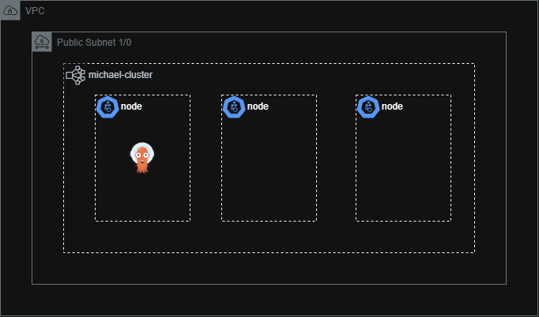

# Terraform Infra-Blacklist

This repository contains Terraform code to deploy infrastructure on AWS, including:

- **Kubernetes cluster** with 3 nodes for the application.
- **Virtual Private Server (VPS)**.
- **Two subnets** in different Availability Zones (AZs).
- **Security Group** to manage network access.
- **ArgoCD** to bootstrap the GitOps process.


---

## Prerequisites

- Terraform version >= 1.0
- AWS account and IAM credentials
- Configured AWS CLI

---

## Usage

1. **Clone the repository**:
   ```bash
   git clone https://github.com/your-username/infra-blacklist.git
   cd infra-blacklist
   ```
2. Initialize Terraform:
   ```bash
   terraform init
   ```
3. Set up variables: Update the variables.tf or create a terraform.tfvars file with your configuration.
4. Deploy infrastructure:
   ```bash
   terraform apply
   ```
5. Verify deployment:
   - Kubernetes cluster: Use kubectl get pods to check the pods.
   - VPS: Check the AWS console for the EC2 instance and associated subnets/security groups.

---

Outputs
After successful deployment, Terraform will output details such as:
- Kubernetes cluster endpoint
- VPS public and private IPs
- Subnet IDs

---

Cleanup
To remove the infrastructure, run:
```bash
terraform destroy
```

---

Notes
- Ensure that the region specified in your Terraform variables supports the required services.
- Costs incurred depend on the AWS resources provisioned.

